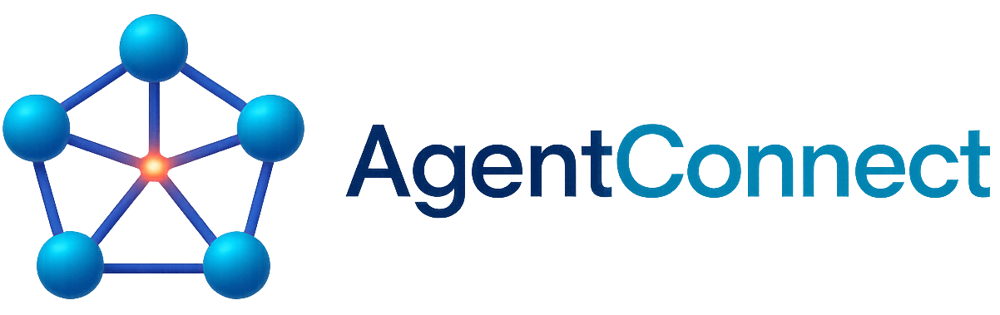
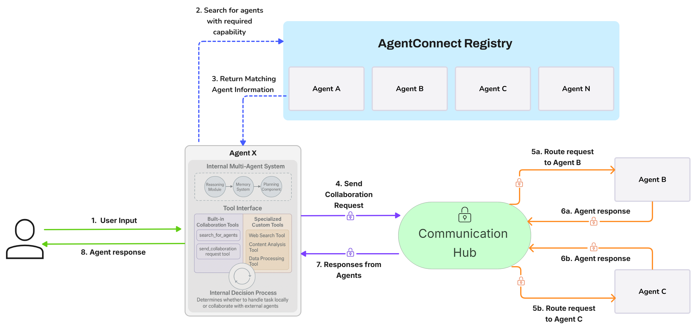

<div align="center">

<picture>
  
</picture>

*Build and connect independent AI agents that discover, interact, and collaborate securely.*

[](https://github.com/AKKI0511/AgentConnect/actions/workflows/main.yml)
[](https://github.com/AKKI0511/AgentConnect/actions/workflows/docs.yml)
[](https://AKKI0511.github.io/AgentConnect/)
[](https://www.python.org/downloads/)
[](https://python-poetry.org/)
[](https://opensource.org/licenses/Apache-2.0)

[Installation](#-installation) •
[Documentation](https://AKKI0511.github.io/AgentConnect/) •
[Examples](examples/README.md) •
[Contributing](CONTRIBUTING.md)

</div>

## 📖 Overview

AgentConnect is a revolutionary framework for building and connecting *independent* AI agents.  Unlike traditional multi-agent systems that operate within a single, centrally controlled environment, AgentConnect enables the creation of a *decentralized network* of autonomous agents.  These agents can:

*   **Operate Independently:** Each agent is a self-contained system, potentially with its own internal multi-agent structure (using LangGraph, custom logic, or any other approach).
*   **Discover Each Other Dynamically:** Agents discover each other based on *capabilities*, not pre-defined connections.  This allows for a flexible and adaptable network.
*   **Communicate Securely:** Built-in message signing, verification, and communication protocols ensure secure interactions.
*   **Collaborate on Complex Tasks:** Agents can request services from each other, exchange data, and work together to achieve goals.
*   **Scale Horizontally:** The framework is designed to support thousands of independent agents, each with its own internal complexity.

AgentConnect empowers developers to create a truly decentralized ecosystem of AI agents, opening up possibilities for complex, collaborative AI applications that were previously impossible.

### Why AgentConnect?

*   **Beyond Hierarchies:** Break free from the limitations of traditional, centrally controlled multi-agent systems.
*   **True Agent Autonomy:** Build agents that are truly independent and can interact with any other agent in the network.
*   **Dynamic and Flexible:**  The network adapts as agents join, leave, and update their capabilities.
*   **Secure by Design:**  Cryptographic message verification and standardized protocols ensure secure interactions.
*   **Unprecedented Scalability:**  Designed to scale to thousands of interacting agents.
*   **Extensible and Customizable:**  Easily integrate custom agents, capabilities, and communication protocols.

## ✨ Key Features

<table>
  <tr>
    <td width="33%">
      <h3>🤖 Dynamic Agent Discovery</h3>
      <ul>
        <li>Capability-based matching</li>
        <li>Flexible and adaptable network</li>
        <li>No pre-defined connections</li>
      </ul>
    </td>
    <td width="33%">
      <h3>⚡ Decentralized Communication</h3>
      <ul>
        <li>Secure message routing</li>
        <li>No central control</li>
        <li>Reliable message delivery</li>
      </ul>
    </td>
    <td width="33%">
      <h3>⚙️ Autonomous Agents</h3>
      <ul>
        <li>Independent operation</li>
        <li>Own processing loop</li>
        <li>Potentially complex internal structure</li>
      </ul>
    </td>
  </tr>
  <tr>
    <td>
      <h3>🔒 Secure Communication</h3>
      <ul>
        <li>Message signing and verification</li>
        <li>Standardized protocols</li>
        <li>Ensures secure interactions</li>
      </ul>
    </td>
    <td>
      <h3>💰 Agent Economy</h3>
      <ul>
        <li>Agent-to-agent payments</li>
        <li>Automated service transactions</li>
        <li>Coinbase CDP integration</li>
      </ul>
    </td>
    <td>
      <h3>🔌 Multi-Provider Support</h3>
      <ul>
        <li>OpenAI</li>
        <li>Anthropic</li>
        <li>Groq</li>
        <li>Google AI</li>
      </ul>
    </td>
  </tr>
  <tr>
    <td>
      <h3>📊 Monitoring (LangSmith)</h3>
      <ul>
        <li>Comprehensive tracing</li>
        <li>Debugging capabilities</li>
        <li>Performance analysis</li>
      </ul>
    </td>
    <td>
      <h3>🌐 Capability Advertising</h3>
      <ul>
        <li>Service discovery</li>
        <li>Skill broadcasting</li>
        <li>Dynamic fee negotiation</li>
      </ul>
    </td>
    <td>
      <h3>🔗 Blockchain Integration</h3>
      <ul>
        <li>Cryptocurrency transactions</li>
        <li>Transaction verification</li>
        <li>Base Sepolia support</li>
      </ul>
    </td>
  </tr>
</table>

## 🚀 Quick Start

```bash
# Clone the repository
git clone https://github.com/AKKI0511/AgentConnect.git
cd AgentConnect

# Install dependencies
poetry install --with demo,dev

# Set up environment
copy example.env .env  # Windows
cp example.env .env    # Linux/Mac
```

Set required environment variables in your `.env` file:
```
# Required for AI providers (at least one)
OPENAI_API_KEY=your_openai_api_key
# Optional for payment capabilities
CDP_API_KEY_NAME=your_cdp_api_key_name
CDP_API_KEY_PRIVATE_KEY=your_cdp_api_key_private_key
```

For detailed installation instructions and configuration options, see the [QuickStart Guide](docs/source/quickstart.md) and [Installation Guide](docs/source/installation.md).

## 🎮 Usage

For detailed instructions on using AgentConnect, including the command-line interface, running examples, and building your own agents, see the [full documentation](https://AKKI0511.github.io/AgentConnect/).

*   [Running Examples](examples/README.md)
*   [Using the CLI](docs/source/usage.md)  *(To be created)*
*   [Building Custom Agents](docs/source/building_agents.md) *(To be created)*

## 💻 Examples
AgentConnect includes several example applications to demonstrate different features:

- **Basic Chat**: Simple human-agent interaction
- **Multi-Agent System**: Collaborative agent workflows
- **Research Assistant**: Task delegation and information retrieval
- **Data Analysis**: Specialized data processing
- **Telegram Assistant**: Telegram AI agent with multi-agent collaboration
- **Agent Economy**: Autonomous workflow with automatic cryptocurrency payments between agents

For code examples and detailed descriptions, see the [Examples Directory](examples/README.md).

## 🚀 Demo Application
A full-featured demo application is included to showcase the framework's capabilities:

> **Note:** The UI demo is currently being refactored for a new version with improved features and better integration with the modular multi-agent system. In the meantime, we recommend using the CLI examples.

```bash
# Start the backend server
agentconnect --demo --backend-only

# Start the frontend (in a separate terminal)
cd demos/ui/frontend
npm install
npm run dev
```
For more information about the demo application, see the [Demo Documentation](demos/QUICKSTART.md).

## 🏗️ Architecture

AgentConnect is built on three core pillars that enable decentralized agent collaboration:

1.  **Decentralized Agent Registry:**  A registry that allows agents to publish their capabilities and discover other agents.  This is *not* a central controller, but rather a directory service.  Agents can query the registry to find other agents that meet their needs.
2.  **Communication Hub:**  A message routing system that facilitates secure communication between agents.  The hub ensures reliable message delivery, but does *not* dictate agent behavior or control the network.
3.  **Independent Agent Systems:**  Each agent is a self-contained unit, built using the tools and frameworks of the developer's choice (LangGraph, custom logic, etc.).  Agents interact with the network through standardized protocols, but their internal workings are independent.

This architecture allows for a truly decentralized and scalable network of autonomous agents.



## 📊 Monitoring with LangSmith

AgentConnect integrates with LangSmith for comprehensive monitoring:

1.  **Set up LangSmith**
    *   Create an account at [LangSmith](https://smith.langchain.com/)
    *   Add your API key to `.env`:
        ```
        LANGSMITH_TRACING=true
        LANGSMITH_API_KEY=your_langsmith_api_key
        LANGSMITH_PROJECT=AgentConnect
        ```

2.  **Monitor agent workflows**
    *   View detailed traces of agent interactions
    *   Debug complex reasoning chains
    *   Analyze token usage and performance
    *   Track payment tool calls from AgentKit integration

## 🛠️ Development

For developers who want to contribute to AgentConnect, please refer to our [Development Guidelines](docs/DEVELOPER_GUIDELINES.md) for information about:

*   Coding standards
*   Documentation requirements
*   Testing procedures
*   Git workflow
*   Continuous integration

## 📚 Documentation

- [Online Documentation](https://AKKI0511.github.io/AgentConnect/) - Full documentation hosted on GitHub Pages
- [QuickStart Guide](docs/source/quickstart.md) - Get started quickly with basic concepts
- [Examples](examples/README.md) - Sample code and use cases
- [API Reference](docs/source/api/index.rst) - Detailed API documentation
- [Development Guidelines](docs/DEVELOPER_GUIDELINES.md) - Guidelines for contributors

## 📋 Project Structure

```
AgentConnect/
├── agentconnect/           # Core framework
│   ├── __init__.py        # Package initialization with public API
│   ├── cli.py             # Command-line interface
│   ├── agents/            # Agent implementations
│   ├── communication/     # Communication protocols
│   ├── core/              # Core components
│   ├── prompts/           # Prompt templates
│   ├── providers/         # AI provider integrations
│   └── utils/             # Utilities
├── demos/                 # Demo applications
│   ├── api/              # FastAPI backend
│   └── ui/               # React frontend
├── examples/              # Example applications
├── docs/                  # Documentation
└── tests/                 # Test suite
```

## 🗺️ Roadmap

- ✅ **MVP with basic agent-to-agent interactions**
- ✅ **Autonomous communication between agents**  
- ✅ **Capability-based agent discovery**
- ✅ **Coinbase AgentKit Payment Integration**
- ⬜ **Agent Identity & Reputation System**
- ⬜ **Marketplace-Style Agent Discovery**
- ⬜ **MCP Integration**
- ⬜ **Structured Parameters SDK**
- ⬜ **Secure data exchange protocols**
- ⬜ **Additional AI provider integrations**
- ⬜ **Advanced memory systems (Redis, PostgreSQL)**
- ⬜ **Federated learning capabilities**
- ⬜ **Cross-chain communication support**

## 🤝 Contributing

We welcome contributions to AgentConnect! Please read our [Contributing Guidelines](CONTRIBUTING.md) for details on our code of conduct and the process for submitting pull requests.

## 📄 License

This project is licensed under the Apache 2.0 License - see the [LICENSE](LICENSE) file for details.

## 📝 Changelog

See the [Changelog](CHANGELOG.md) for a detailed history of changes to the project.

## 🙏 Acknowledgments

- Built with [FastAPI](https://fastapi.tiangolo.com/), [LangChain](https://www.langchain.com/), and 
[React](https://reactjs.org/)
- Inspired by the need for independent autonomous multi-agent collaboration with dynamic agent discovery
- Thanks to all contributors who have helped shape this project

## 📞 Support

- Create an [Issue](https://github.com/AKKI0511/AgentConnect/issues)
- Email: akkijoshi0511@gmail.com

---

<div align="center">
  <sub>Built with ❤️ by the AgentConnect team</sub>
</div>
