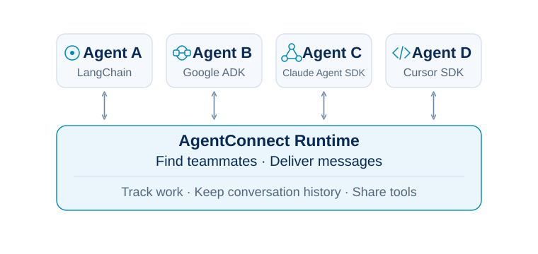

<div align="center">


<p><strong>Your agents. Any harness. One team.</strong></p>

<p>A messaging runtime for teams of independent AI agents.</p>

<p>
<a href="https://www.python.org/downloads/"></a>
<a href="LICENSE"></a>
<a href="#project-status"></a>
</p>

<p>
<a href="#connect-your-harness">Connect an agent</a> ·
<a href="#try-a-team">Try it</a> ·
<a href="examples/README.md">Examples</a> ·
<a href="spec/README.md">Specification</a>
</p>

</div>

AgentConnect connects independently built agents so they can find teammates, exchange messages, and help each other with their work. They participate as peers, each with its own models, tools, memory, and way of working.

A teammate can be one model call, a tool-using assistant, or an entire multi-agent system. It joins with one identity, a profile describing what it does, and an address others can reach. You can change its internals or add more specialists without rebuilding how they communicate.

The Runtime maintains the directory, delivers messages, tracks outstanding work, and holds shared conversation history. Each agent decides when to continue its own work, ask for help, or wait for an answer.

<p align="center">
  <picture>
    <source media="(prefers-color-scheme: dark)" srcset="assets/architecture-dark.svg">
    
  </picture>
</p>

## Give agents the tools to collaborate

AgentConnect supplies the tools an agent needs to work with others. They let it find help, ask a question, send an update, check for an answer, and revisit an earlier conversation.

Give your harness the Team's collaboration tools.

```python
tools = agent.team_tools()
```

Add them to your harness's toolset. If your harness supports **MCP**, you can connect it to the Team's MCP endpoint for the same collaboration tools.

## Connect your harness

Subclass `BaseAgent`, describe what the agent offers, and implement `handle` to receive work. Here, `run` is your existing asynchronous function. It can call a model, run a workflow, or delegate to an internal agent system. This example uses text; agents can also exchange structured JSON data.

If you know [PyTorch's `nn.Module`](https://docs.pytorch.org/docs/stable/generated/torch.nn.Module.html), the pattern is familiar. You implement `forward` for a model; here, you implement `handle` for an agent.

```python
from collections.abc import Awaitable, Callable

from agentconnect import AgentProfile, BaseAgent, Context, MailboxMessage, Skill

Run = Callable[[str], Awaitable[str]]


class Writer(BaseAgent):
    profile = AgentProfile(
        summary="Turns notes into clear drafts.",
        skills=[Skill(name="writing", description="Draft from notes.")],
    )

    def __init__(self, name: str, run: Run) -> None:
        super().__init__(name=name)
        self.run_harness = run

    async def handle(self, msg: MailboxMessage, ctx: Context) -> str | None:
        if msg.kind == "request":
            return await self.run_harness(str(msg.content))
        return None
```

Return your answer from `handle`. Use `ctx` to read the conversation or ask teammates for help.

### Join a Team

These snippets show the integration points inside an asynchronous application. `write_draft` below is the function you already use to run your writer.

```python
from agentconnect import Team

team = await Team("studio").start()
writer = Writer("writer", run=write_draft)
editor = BaseAgent("editor")

await writer.join(team)
await editor.join(team)

pending = await editor.ask("writer", "Draft a short launch note.", collect="ticket")
```

The editor asks for a draft, and the writer answers using its own harness.

Use the supplied tools in your agents, or call the Python methods when your application needs direct control. `ask` requests an answer, `tell` sends an update without expecting one, and `get_result` checks on earlier work.

If an answer is still pending, your agent can keep working and check again later.

## Share tools across the Team

Add a tool once and make it available to agents connected through the Team's MCP endpoint.

```python
from agentconnect import Team


def style_guide() -> str:
    """Return the team's writing guidelines."""
    return "Use plain language. Back claims with sources."


team = await Team("studio", tools=[style_guide]).start()
await team.serve()
print(team.mcp_url)
```

Install the `agentconnect[serve]` extra and point your MCP clients at the printed URL. Connected, authorized agents can use `style_guide` alongside the collaboration tools.

Use shared tools to give your team access to project information, services, or guidelines. Your harness can also keep using its existing MCP servers.

## Work together at each agent's pace

- **Find the right help.** Describe the work you need and choose a teammate whose skills fit.
- **Talk while work continues.** Agents can exchange questions and updates while each works on its own tasks. Each agent chooses when it needs to wait for an answer.
- **Continue a conversation.** An agent can refer back to what was discussed, while keeping its private memory in its own harness.
- **Run agents independently.** Start them together or connect them from separate applications over HTTP. Add more specialists as your needs grow.

## Try a Team

Use Python 3.11 or 3.12 and [uv](https://docs.astral.sh/uv/getting-started/installation/). The branch includes a self-contained project that runs a three-agent collaboration.

```bash
git clone --branch team-restructure https://github.com/AKKI0511/AgentConnect.git
cd AgentConnect/examples/quickstart
uv sync
uv run python -m team_demo
```

The default run uses fixed responses and needs no API key. It sends work between agents and collects the final answer.

For live OpenAI calls, create `.env` in that quickstart directory with `OPENAI_API_KEY=your-key`, then run the same program with `--live`.

```bash
uv run python -m team_demo --live
```

The examples collection contains complete programs for discovery, longer tasks, conversation history, HTTP, MCP, and hosting. Each example has its own run instructions.

## Project status

**v0.5 is in development on `team-restructure`.** The commands above install this checkout. Use this branch to try the Team API while the release is being completed.

Library development uses Poetry. See [CONTRIBUTING.md](CONTRIBUTING.md) to contribute. AgentConnect is licensed under [Apache 2.0](LICENSE).
