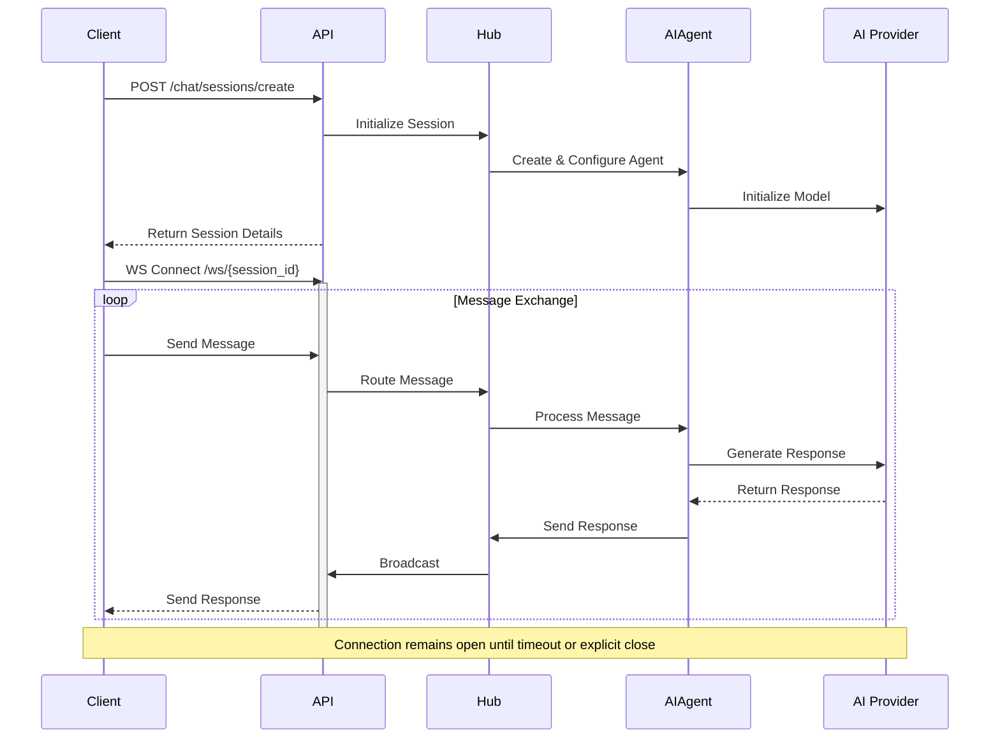
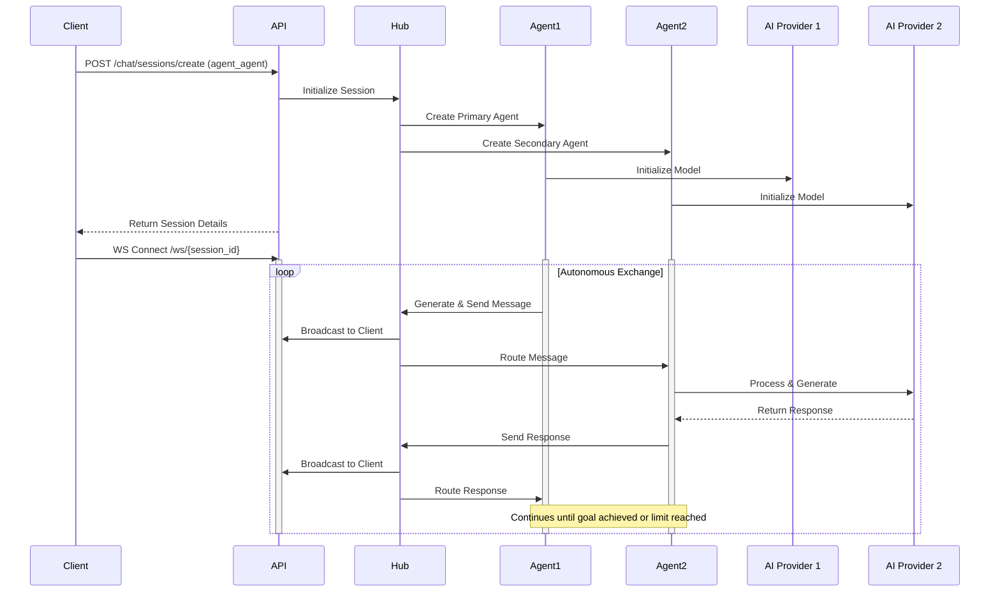
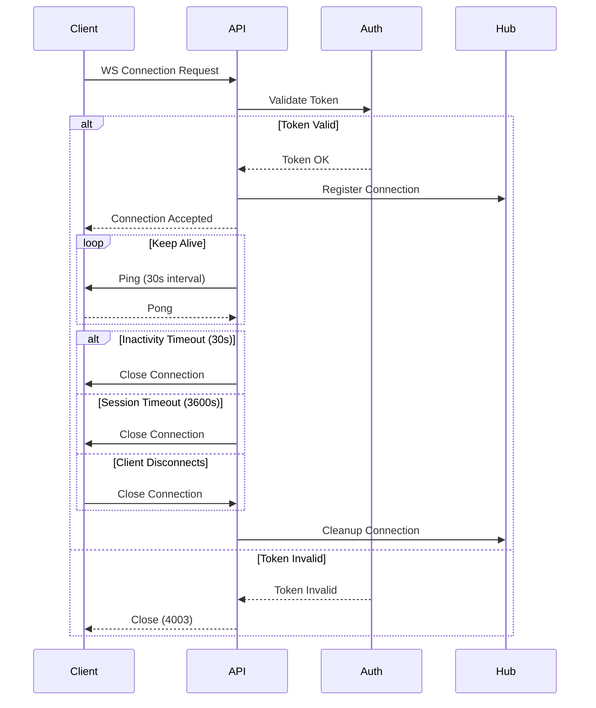

# AgentConnect API Documentation

## Overview
The AgentConnect API provides a WebSocket-based communication system with REST endpoints for managing AI agent interactions. Built with FastAPI, it supports multiple AI providers and implements secure authentication.

## Interaction Patterns

### Human-Agent Communication
The system enables real-time communication between human users and AI agents through WebSocket connections:



Key Features:
- Real-time bidirectional communication
- Automatic message routing
- Provider-agnostic interface
- Session state management
- Automatic cleanup on inactivity

### Agent-Agent Communication
Enables autonomous communication between AI agents with real-time monitoring:



Key Features:
- Autonomous interaction
- Multi-provider support
- Real-time monitoring
- Structured data exchange
- Configurable interaction patterns

### WebSocket Connection Lifecycle



Key Features:
- Token-based authentication
- Automatic keep-alive
- Timeout handling
- Clean disconnection
- Resource cleanup

## Base URL
```
http://localhost:8000/api
```

## Authentication
All endpoints require JWT authentication:
```http
Authorization: Bearer <token>
```

### Obtaining Tokens
```http
POST /auth/login
Content-Type: application/x-www-form-urlencoded

username=<username>&password=<password>
```

**Response:**
```json
{
  "access_token": "string",
  "token_type": "bearer",
  "expires_in": 1800
}
```

**Errors:**
- 401: Invalid credentials
- 422: Validation error
- 429: Too many attempts

### Verify Token
Verifies if a JWT token is valid and returns the token's claims.

```http
POST /auth/verify
Authorization: Bearer <token>
```

**Response:** `200 OK`
```json
{
  "valid": true,
  "claims": {
    "sub": "username",
    "exp": 1234567890,
    "iat": 1234567890,
    "type": "access"
  }
}
```

**Errors:**
- 401: Invalid or expired token
- 422: Malformed token
- 429: Too many attempts (10 requests/minute)

## WebSocket Communication
Connect to: `ws://localhost:8000/api/ws/{session_id}`

### Authentication Options
1. Query parameter: `?token=<jwt>`
2. Header: `Authorization: Bearer <jwt>`

### Message Format
```typescript
interface Message {
  type: "text" | "error" | "info" | "system" | "response" | "stop" | "cooldown";
  content?: string;
  sender?: string;
  receiver?: string;
  timestamp?: string;
  metadata?: Record<string, any>;
}

// Example: Sending a message
{
  "type": "text",
  "content": "Hello AI!",
  "timestamp": "2024-02-17T12:00:00Z"
}

// Example: Receiving a response
{
  "type": "text",
  "content": "Hello Human!",
  "sender": "ai_session_123",
  "receiver": "human_session_123",
  "timestamp": "2024-02-17T12:00:01Z",
  "metadata": {
    "role": "assistant"
  }
}
```

## REST Endpoints

### Chat Sessions

#### Create Session
Creates a new chat session with specified configuration.

```http
POST /chat/sessions/create
Content-Type: application/json
Authorization: Bearer <token>
```

**Request Body:**
```typescript
interface CreateSessionRequest {
  // Required fields
  session_type: "human_agent" | "agent_agent";
  provider: "groq" | "anthropic" | "openai" | "google";
  
  // Optional fields
  model?: string;  // Default: provider's default model
  capabilities?: string[];  // Default: ["conversation"]
  personality?: string;  // Default: "helpful and professional"
  metadata?: Record<string, any>;
}
```

**Response:** `200 OK`
```typescript
interface SessionResponse {
  session_id: string;  // Format: session_YYYYMMDDHHMMSS_<uuid>
  type: "system";
  created_at: string;  // ISO timestamp
  status: "active" | "initializing";
  provider: string;
  model: string;
  metadata: {
    // For human-agent sessions:
    human_agent_id?: string;  // Format: human_<session_id>
    ai_agent_id?: string;    // Format: ai1_<session_id>
    
    // For agent-agent sessions:
    agent1_id?: string;      // Format: ai1_<session_id>
    agent2_id?: string;      // Format: ai2_<session_id>
  }
}
```

**Example Request:**
```json
{
  "session_type": "human_agent",
  "provider": "groq",
  "model": "llama-3-70b",
  "capabilities": ["conversation"],
  "personality": "helpful and professional"
}
```

**Example Response:**
```json
{
  "session_id": "session_20240217120000_abc123",
  "type": "system",
  "created_at": "2024-02-17T12:00:00Z",
  "status": "active",
  "provider": "groq",
  "model": "llama-3-70b",
  "metadata": {
    "human_agent_id": "human_session_20240217120000_abc123",
    "ai_agent_id": "ai1_session_20240217120000_abc123"
  }
}
```

**Errors:**
- 400: Invalid request body
- 401: Unauthorized
- 422: Validation error
- 429: Rate limit exceeded (5 requests/minute)
- 500: Server error

#### Get Session
Retrieves information about an existing chat session.

```http
GET /chat/sessions/{session_id}
Authorization: Bearer <token>
```

**Response:** `200 OK`
```typescript
// Same as SessionResponse above
```

**Errors:**
- 401: Unauthorized
- 404: Session not found
- 429: Rate limit exceeded (10 requests/minute)

#### Delete Session
Ends and cleans up a chat session.

```http
DELETE /chat/sessions/{session_id}
Authorization: Bearer <token>
```

**Response:** `204 No Content`

**Errors:**
- 401: Unauthorized
- 403: Not session owner
- 404: Session not found
- 429: Rate limit exceeded (5 requests/minute)

#### List Providers
Returns available AI providers and their models.

```http
GET /chat/providers
Authorization: Bearer <token>
```

**Response:** `200 OK`
```typescript
interface ProvidersResponse {
  providers: {
    [provider: string]: {
      models: string[];
      capabilities: string[];
      default_model: string;
    }
  }
}
```

**Example Response:**
```json
{
  "providers": {
    "groq": {
      "models": ["llama-3-70b", "mixtral-8x7b"],
      "capabilities": ["conversation", "analysis"],
      "default_model": "llama-3-70b",
      "is_available": true
    }
  }
}
```

**Errors:**
- 401: Unauthorized
- 429: Rate limit exceeded (10 requests/minute)

### Agent Management

#### Register Agent
Registers a new AI agent in the system.

```http
POST /agents/register
Content-Type: application/json
Authorization: Bearer <token>
```

**Request Body:**
```typescript
interface AgentConfig {
  name: string;
  provider: string;
  model?: string;
  capabilities?: string[];  // Default: ["conversation"]
  interaction_modes?: string[];  // Default: ["human_to_agent"]
  personality?: string;
  metadata?: Record<string, any>;
}
```

**Response:** `200 OK`
```typescript
interface AgentRegistrationResponse {
  agent_id: string;  // Format: agent_YYYYMMDDHHMMSS_<user_id>
  status: "registered";
  name: string;
  provider: string;
  model: string;
  capabilities: string[];
  interaction_modes: string[];
  owner_id: string;
  timestamp: string;
}
```

**Example Request:**
```json
{
  "name": "Analysis Assistant",
  "provider": "groq",
  "model": "llama-3-70b",
  "capabilities": ["analysis", "conversation"],
  "interaction_modes": ["human_to_agent", "agent_to_agent"],
  "personality": "analytical and precise"
}
```

**Errors:**
- 400: Invalid configuration
- 401: Unauthorized
- 422: Validation error
- 429: Rate limit exceeded (5 requests/minute)
- 500: Registration failed

#### Unregister Agent
Removes an agent from the system.

```http
DELETE /agents/{agent_id}
Authorization: Bearer <token>
```

**Response:** `200 OK`
```json
{
  "agent_id": "string",
  "status": "unregistered",
  "timestamp": "2024-02-17T12:00:00Z"
}
```

**Errors:**
- 401: Unauthorized
- 403: Not agent owner
- 404: Agent not found
- 429: Rate limit exceeded (5 requests/minute)

#### List Agents
Returns all registered agents accessible to the user.

```http
GET /agents/list
Authorization: Bearer <token>
```

**Response:** `200 OK`
```typescript
interface AgentListResponse {
  agents: Array<{
    agent_id: string;
    name: string;
    provider: string;
    model: string;
    capabilities: string[];
    interaction_modes: string[];
    status: "active" | "inactive" | "error";
    owner_id: string;
    created_at: string;
    last_active: string;
    is_owned: boolean;
  }>;
  timestamp: string;
  total_count: number;
  user_owned_count: number;
}
```

**Errors:**
- 401: Unauthorized
- 429: Rate limit exceeded (10 requests/minute)

#### Send Agent Message
Sends a message from one agent to another.

```http
POST /agents/{agent_id}/message
Content-Type: application/json
Authorization: Bearer <token>
```

**Request Body:**
```typescript
interface AgentMessageRequest {
  receiver_id: string;
  content: string;
  message_type: string;
  structured_data?: Record<string, any>;
  metadata?: Record<string, any>;
}
```

**Response:** `200 OK`
```typescript
interface AgentMessageResponse {
  status: "sent";
  message_id: string;
  sender: string;
  receiver: string;
  timestamp: string;
}
```

**Errors:**
- 401: Unauthorized
- 403: Not agent owner
- 404: Agent not found
- 422: Invalid message format
- 429: Rate limit exceeded (20 requests/minute)

#### Get Agent Capabilities
Returns detailed information about an agent's capabilities.

```http
GET /agents/{agent_id}/capabilities
Authorization: Bearer <token>
```

**Response:** `200 OK`
```typescript
interface AgentCapabilitiesResponse {
  agent_id: string;
  agent_type: string;
  capabilities: string[];
  interaction_modes: string[];
  personality?: string;
  owner_id: string;
  timestamp: string;
}
```

**Errors:**
- 401: Unauthorized
- 403: Not authorized to view
- 404: Agent not found
- 429: Rate limit exceeded (10 requests/minute)

#### Get Agent Status
Returns detailed status information about an agent.

```http
GET /agents/status/{agent_id}
Authorization: Bearer <token>
```

**Response:** `200 OK`
```typescript
interface AgentStatus {
  agent_id: string;
  agent_type: string;
  name?: string;
  status: "active" | "inactive" | "cooldown";
  last_active: string;
  capabilities: string[];
  interaction_modes: string[];
  owner_id: string;
  is_running: boolean;
  message_count: number;
  metadata: {
    provider?: string;
    model?: string;
    cooldown_until?: string | null;
    active_conversations?: number;
    total_messages_processed?: number;
  };
}
```