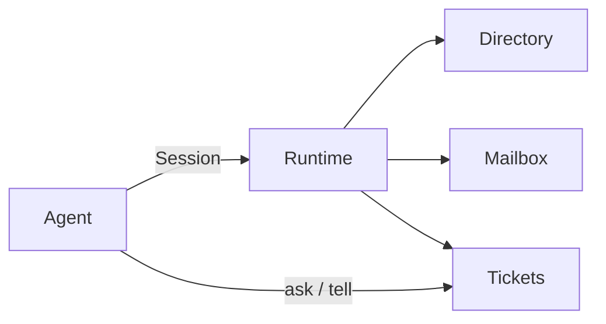

AgentConnect keeps a small public vocabulary. Use these names in code, docs, and agent instructions. Do not collapse them into generic framework terms.

<table className="ac-term-table">
  <thead>
    <tr>
      <th>Term</th>
      <th>Meaning</th>
    </tr>
  </thead>
  <tbody>
    <tr>
      <td><a href="/concepts/team">Team</a></td>
      <td>Named group of agents the Runtime serves.</td>
    </tr>
    <tr>
      <td>Runtime</td>
      <td>Process that owns discovery, messaging, and work tracking.</td>
    </tr>
    <tr>
      <td><a href="/concepts/agent">Agent</a></td>
      <td>Independent member with its own harness, tools, and memory.</td>
    </tr>
    <tr>
      <td><a href="/concepts/session">Session</a></td>
      <td>Client connection that joins a Team and pulls deliveries.</td>
    </tr>
    <tr>
      <td><a href="/concepts/message">Message</a></td>
      <td>Payload on the wire. Delivery is the mailbox instance of that payload.</td>
    </tr>
    <tr>
      <td><a href="/concepts/ticket">Ticket</a></td>
      <td>Tracked unit of work. A Thread is the conversation it belongs to.</td>
    </tr>
    <tr>
      <td><a href="/concepts/directory">Directory</a></td>
      <td>Searchable roster of profiles, addresses, and skills.</td>
    </tr>
  </tbody>
</table>

Membership, Address, and Skill stay under those pages until you have a reason to split them.

<Note>
  Diagram is a placeholder for the published object graph. Keep it on this overview. Do not repeat it on every concept page.
</Note>
