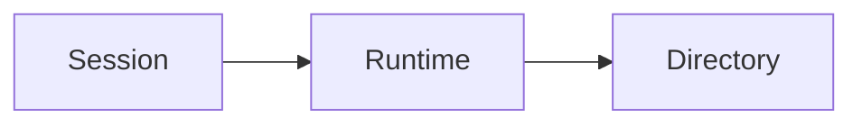

This page is the component shelf. New docs should look like the rest of the site, not like a new product. Copy [Concept](/templates/concept), [Guide](/templates/guide), [Recipe](/templates/recipe), or [Empty](/templates/empty).

## Rules

- Sentence case headings.
- One job per page.
- Links, not icon cards, for next steps.
- Code fences always have a language.
- Callouts only when skipping them would hide a constraint.

## Callouts

<Note>Safe to skip. Extra context.</Note>
<Info>Permissions, extras, or generated-file warnings.</Info>
<Tip>A preferred default.</Tip>
<Warning>Destructive or easy-to-miss constraint.</Warning>
<Danger>Data loss or a breaking change.</Danger>

## Steps

<Steps>
  <Step title="Name the action">
    One verb. Put the command or snippet inside the step.
  </Step>
  <Step title="Show the result">
    How the reader knows it worked.
  </Step>
</Steps>

## Language tabs

<CodeGroup>

```bash pip
pip install agentconnect
```

```bash uv
uv add agentconnect
```

</CodeGroup>

## SDK tabs

<Tabs>
  <Tab title="Python">
    Default SDK. Keep this tab first.
  </Tab>
  <Tab title="CLI">
    Same job from a shell.
  </Tab>
</Tabs>

## Definition table

| Term | Meaning |
| --- | --- |
| Team | Named group the Runtime serves |
| Ticket | Tracked unit of work |

## Disclosure

<AccordionGroup>
  <Accordion title="Rare path">
    Hide branches that most readers should not take on the first pass.
  </Accordion>
</AccordionGroup>

## API-shaped fields

Use on CLI and HTTP pages. Generated Python pages already emit these from docstrings.

<ParamField path="recipient" type="string" required>
  Directory name or address.
</ParamField>

<ResponseField name="ticket" type="Ticket">
  Current ticket. It may still be `open` when collect waits end.
</ResponseField>

## Diagram



## File tree

<Tree>
  <Tree.Folder name="docs-v2" defaultOpen>
    <Tree.File name="docs.json" />
    <Tree.File name="style.css" />
    <Tree.Folder name="concepts">
      <Tree.File name="overview.mdx" />
    </Tree.Folder>
  </Tree.Folder>
</Tree>

## Related links

Do not use a card grid for this. A list is enough:

- [Concept template](/templates/concept)
- [Guide template](/templates/guide)
- [Recipe template](/templates/recipe)
